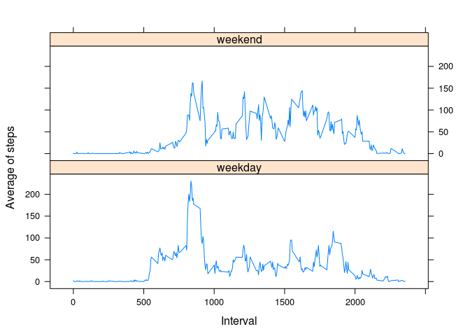

# Reproducible Research: Peer Assessment 1


## Loading and preprocessing the data


```r
Sys.setlocale(category = 'LC_ALL', locale='en_US.UTF-8')
```

```
## [1] "LC_CTYPE=en_US.UTF-8;LC_NUMERIC=C;LC_TIME=en_US.UTF-8;LC_COLLATE=en_US.UTF-8;LC_MONETARY=en_US.UTF-8;LC_MESSAGES=en_US.UTF-8;LC_PAPER=de_CH.UTF-8;LC_NAME=C;LC_ADDRESS=C;LC_TELEPHONE=C;LC_MEASUREMENT=de_CH.UTF-8;LC_IDENTIFICATION=C"
```

```r
# unzip activity.zip, if not already unzipped
if (!file.exists('activity.csv'))
    unzip(zipfile = 'activity.zip', exdir = '.')

# read data
data <- read.csv(file = 'activity.csv', header = TRUE, sep = ',')
data$date <- as.Date(as.character(data$date), '%Y-%m-%d')
tidy <- data[!is.na(data$steps), ]
```


## What is mean total number of steps taken per day?

```r
d <- aggregate(steps~date, tidy, sum)
plot(d$date, d$steps, type="h", ylab = 'Total steps', xlab = 'Date', 
     main = 'Total steps in 2012')
```

 

- The *mean* total number of steps taken per day is **1.0766189\times 10^{4}**
- The *median* total number of steps taken per day: **10765**


## What is the average daily activity pattern?

```r
dinterval <- aggregate(steps~interval, tidy, mean)
plot(dinterval, type='l', ylab='Average number of steps taken', xlab='interval of 5 minutes')
```

 

```r
# find max index
index <- which.max(d$steps)
```
Maximun 5-minute interval is entry number **47** with values **interval 2012-11-23** and **steps mean 21194** 


## Imputing missing values
### Number of missing values in the dataset 

```r
numberOfNA <- nrow(data[is.na(data$steps),])
```

- Total number of missing values in the dataset is **2304**

Filling the  missing steps values by assigning the average for similar intervals.

```r
fixed <- data
fixedNA <- is.na(fixed$steps)
fixed[fixedNA, 1] <- sapply(fixed[fixedNA, 3], function(x) dinterval[dinterval$interval == x, 2])
f <- aggregate(steps~date, fixed, sum)
plot(f$date, f$steps, type="h", ylab = 'Total steps', xlab = 'Date', 
     main = 'Total steps in 2012')
```

 

- The *mean* total number of steps taken per day is **1.0766189\times 10^{4}**
- The *median* total number of steps taken per day: **1.0766189\times 10^{4}**


**What is the impact of imputing missing data on the estimates of the total daily number of steps?**  
*There is no impact on the mean total number of steps. And there is a small impact on the median.*


## Are there differences in activity patterns between weekdays and weekends?


```r
# helper funciton to determine if a date is a weekday or a weekend
isWeekend <- function(x) {
    wd <- weekdays(x)
    if (wd %in% c('Monday', 'Tuesday', 'Wednesday', 'Thursday', 'Friday'))
        'weekday'
    else 
        'weekend'
}

# add a new field to the dataset which indicate if the date is a weekday or a weekend
fixed$daytype <- sapply(fixed$date, isWeekend)

# calc steps mean
wdata <- aggregate(steps~interval+daytype, fixed, mean)
#weekenddata <- wdata[wdata$daytype=='weekend', c(1,3)]
#weekdaydata <- wdata[wdata$daytype=='weekday', c(1,3)]
#par(mfrow = c(2,1))
#plot(weekdaydata, type='l', ylab="Mean steps", xlab="Interval")
#plot(weekenddata, type='l', ylab="Mean steps", xlab="Interval")
library(lattice)
xyplot( steps ~ interval | daytype, wdata, type="l", xlab="Interval", ylab="Average of steps", layout=c(1,2))
```

 

It seems that there is more steps on weekends


